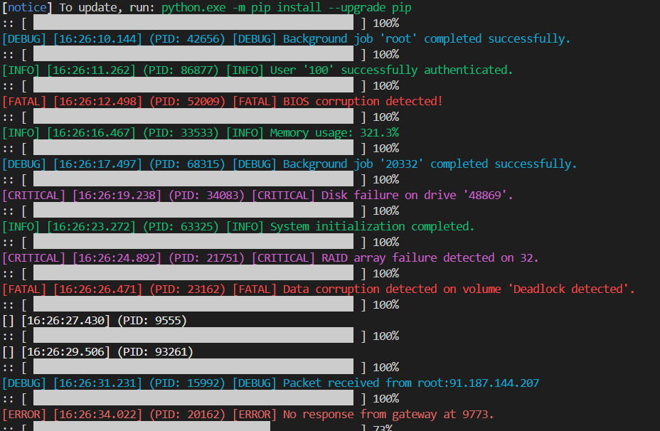

# プログラさぼり君

このプログラムは、ランダムなログメッセージを生成し、ログレベルに応じて色付けして表示します。

これを使うとプログラムをコンパイルしているように見せかけたりしてプログラミングをさぼれます。

### 使い方:
- プログラムを実行すると、ランダムなログメッセージが表示されます。
- ログメッセージは、同じディレクトリに設置されたlog.txtファイ 　ルに記述されたものからランダムに選択されます。

必要なライブラリ:
- colorama

#### その他
著作権は放棄しませんが商用利用、改変、再配布など自由に
していただいて構いません。クレジットも不要です。

© 2025 nekogakure. Reproduction allowed.